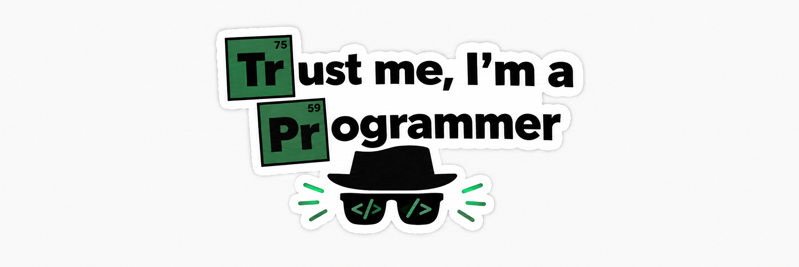

# krishkad

Full-stack developer building clean, fast web products.

---

## About

I'm a full-stack developer who likes building web applications that do one thing well. I care about clear interfaces, typed code, and products that feel simple to use even when the problem behind them isn't.

Most of my work lives in the TypeScript and Next.js ecosystem. I've built tools across a few areas: influencer-marketing software for agencies, real-time communication and video meetings, and photo-focused web apps. Each project taught me something different, from managing complex data flows to handling live connections and building polished UI.

I work across the whole stack, from designing the interface and component structure to shaping the data layer and shipping to production. I prefer small, readable code over clever abstractions, and I'd rather ship something real and improve it than polish an idea that nobody has used.

I'm currently focused on:

- Building production-ready full-stack apps with Next.js
- Real-time features such as chat and video
- Better product design, so what I build is useful and not just functional

---

## Skills

**Languages** 
    

**Frontend** 
   

**Backend and Databases** 
       

**Python Backend** 
      

**AI and Machine Learning** 
           

**LLMs and RAG** 
            

**APIs, Payments and Realtime** 
     

**Tools and Platforms** 
     

---

## Projects

### [influencer](https://github.com/krishkad/influencer)
A platform that helps agencies run influencer marketing campaigns, from discovering creators to managing them.
`TypeScript`

<!-- Replace the placeholder link below with your screenshot, e.g. assets/influencer.png -->

 

### [talky](https://github.com/krishkad/talky)
A communication app built around conversation.
`TypeScript`

 

### [time-pass](https://github.com/krishkad/time-pass)
A video-meeting experiment, codenamed *kkad-meet*.
`TypeScript`

 

### [fotofix](https://github.com/krishkad/fotofix)
A photo-focused web app built on Next.js, Tailwind and shadcn/ui.
`Next.js` `Tailwind`

 

### [foto](https://github.com/krishkad/foto)
An earlier take on the photo idea, where the concept started.
`TypeScript`

 

More on my [repositories page](https://github.com/krishkad?tab=repositories).

---

## Principles

- Simple over clever
- Type everything
- Ship, then refine

---

## Contact

[GitHub](https://github.com/krishkad)

<!-- Add your own: [LinkedIn](https://linkedin.com/in/your-handle) · [Portfolio](https://your-site.com) · [Email](mailto:you@example.com) -->
